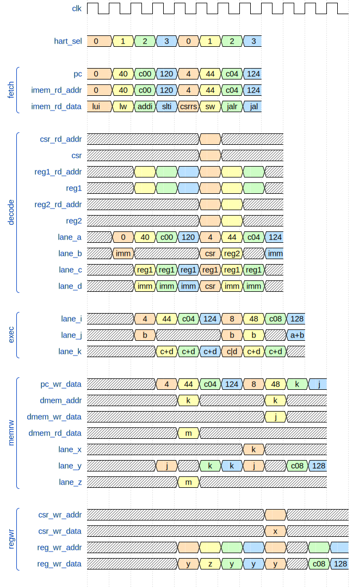

# Timberwolf RiscV core

## About

Timberwolf is a 4-thread 5-stage RISC-V barrel pipeline

Copyright pending. Code will be uploaded once approved (might take a couple of months :|)

## Architecture


## Dataflow

```
RV32I
-----
LUI     Y   !! A=PC B=IMM C=?   D=?   ! I=A+4 J=B   K=?    ! P=I  X=? Y=J Z=? ! CSR=? RD=Y !!
AUIPC   Y   !! A=PC B=IMM C=?   D=?   ! I=A+4 J=A+B K=?    ! P=I  X=? Y=J Z=? ! CSR=? RD=Y !!
JAL     Y   !! A=PC B=IMM C=?   D=?   ! I=A+4 J=A+B K=?    ! P=J  X=? Y=I Z=? ! CSR=? RD=Y !!
JALR    Y   !! A=PC B=?   C=RS1 D=IMM ! I=A+4 J=?   K=C+D  ! P=K  X=? Y=I Z=? ! CSR=? RD=Y !!
BEQ     Y   !! A=PC B=IMM C=RS1 D=RS2 ! I=A+4 J=A+B K=C==D ! P=IJ X=? Y=? Z=? ! CSR=? RD=? !!
BNE     Y   !! A=PC B=IMM C=RS1 D=RS2 ! I=A+4 J=A+B K=C!=D ! P=IJ X=? Y=? Z=? ! CSR=? RD=? !!
BLT     Y   !! A=PC B=IMM C=RS1 D=RS2 ! I=A+4 J=A+B K=C<D  ! P=IJ X=? Y=? Z=? ! CSR=? RD=? !!
BGE     Y   !! A=PC B=IMM C=RS1 D=RS2 ! I=A+4 J=A+B K=C>=D ! P=IJ X=? Y=? Z=? ! CSR=? RD=? !!
BLTU    Y   !! A=PC B=IMM C=RS1 D=RS2 ! I=A+4 J=A+B K=C<D  ! P=IJ X=? Y=? Z=? ! CSR=? RD=? !!
BGEU    Y   !! A=PC B=IMM C=RS1 D=RS2 ! I=A+4 J=A+B K=C>=D ! P=IJ X=? Y=? Z=? ! CSR=? RD=? !!
LB      Y   !! A=PC B=?   C=RS1 D=IMM ! I=A+4 J=?   K=C+D  ! P=I  X=? Y=? Z=M ! CSR=? RD=Z !!
LH      Y   !! A=PC B=?   C=RS1 D=IMM ! I=A+4 J=?   K=C+D  ! P=I  X=? Y=? Z=M ! CSR=? RD=Z !!
LW      Y   !! A=PC B=?   C=RS1 D=IMM ! I=A+4 J=?   K=C+D  ! P=I  X=? Y=? Z=M ! CSR=? RD=Z !!
LBU     Y   !! A=PC B=?   C=RS1 D=IMM ! I=A+4 J=?   K=C+D  ! P=I  X=? Y=? Z=M ! CSR=? RD=Z !!
LHU     Y   !! A=PC B=?   C=RS1 D=IMM ! I=A+4 J=?   K=C+D  ! P=I  X=? Y=? Z=M ! CSR=? RD=Z !!
SB      Y   !! A=PC B=RS2 C=RS1 D=IMM ! I=A+4 J=B   K=C+D  ! P=I  X=? Y=? Z=? ! CSR=? RD=? !!
SH      Y   !! A=PC B=RS2 C=RS1 D=IMM ! I=A+4 J=B   K=C+D  ! P=I  X=? Y=? Z=? ! CSR=? RD=? !!
SW      Y   !! A=PC B=RS2 C=RS1 D=IMM ! I=A+4 J=B   K=C+D  ! P=I  X=? Y=? Z=? ! CSR=? RD=? !!
ADDI    Y   !! A=PC B=?   C=RS1 D=IMM ! I=A+4 J=?   K=C+D  ! P=I  X=? Y=K Z=? ! CSR=? RD=Y !!
SLTI    Y   !! A=PC B=?   C=RS1 D=IMM ! I=A+4 J=?   K=C<D  ! P=I  X=? Y=K Z=? ! CSR=? RD=Y !!
SLTIU   Y   !! A=PC B=?   C=RS1 D=IMM ! I=A+4 J=?   K=C<D  ! P=I  X=? Y=K Z=? ! CSR=? RD=Y !!
XORI    Y   !! A=PC B=?   C=RS1 D=IMM ! I=A+4 J=?   K=C^D  ! P=I  X=? Y=K Z=? ! CSR=? RD=Y !!
ORI     Y   !! A=PC B=?   C=RS1 D=IMM ! I=A+4 J=?   K=C|D  ! P=I  X=? Y=K Z=? ! CSR=? RD=Y !!
ANDI    Y   !! A=PC B=?   C=RS1 D=IMM ! I=A+4 J=?   K=C&D  ! P=I  X=? Y=K Z=? ! CSR=? RD=Y !!
SLLI    Y   !! A=PC B=?   C=RS1 D=IMM ! I=A+4 J=?   K=C<<D ! P=I  X=? Y=K Z=? ! CSR=? RD=Y !!
SRLI    Y   !! A=PC B=?   C=RS1 D=IMM ! I=A+4 J=?   K=C>>D ! P=I  X=? Y=K Z=? ! CSR=? RD=Y !!
SRAI    Y   !! A=PC B=?   C=RS1 D=IMM ! I=A+4 J=?   K=C->D ! P=I  X=? Y=K Z=? ! CSR=? RD=Y !!
ADD     Y   !! A=PC B=?   C=RS1 D=RS2 ! I=A+4 J=?   K=C+D  ! P=I  X=? Y=K Z=? ! CSR=? RD=Y !!
SUB     Y   !! A=PC B=?   C=RS1 D=RS2 ! I=A+4 J=?   K=C-D  ! P=I  X=? Y=K Z=? ! CSR=? RD=Y !!
SLL     Y   !! A=PC B=?   C=RS1 D=RS2 ! I=A+4 J=?   K=C<<D ! P=I  X=? Y=K Z=? ! CSR=? RD=Y !!
SLT     Y   !! A=PC B=?   C=RS1 D=RS2 ! I=A+4 J=?   K=C<D  ! P=I  X=? Y=K Z=? ! CSR=? RD=Y !!
SLTU    Y   !! A=PC B=?   C=RS1 D=RS2 ! I=A+4 J=?   K=C<D  ! P=I  X=? Y=K Z=? ! CSR=? RD=Y !!
XOR     Y   !! A=PC B=?   C=RS1 D=RS2 ! I=A+4 J=?   K=C^D  ! P=I  X=? Y=K Z=? ! CSR=? RD=Y !!
SRL     Y   !! A=PC B=?   C=RS1 D=RS2 ! I=A+4 J=?   K=C>>D ! P=I  X=? Y=K Z=? ! CSR=? RD=Y !!
SRA     Y   !! A=PC B=?   C=RS1 D=RS2 ! I=A+4 J=?   K=C->D ! P=I  X=? Y=K Z=? ! CSR=? RD=Y !!
OR      Y   !! A=PC B=?   C=RS1 D=RS2 ! I=A+4 J=?   K=C|D  ! P=I  X=? Y=K Z=? ! CSR=? RD=Y !!
AND     Y   !! A=PC B=?   C=RS1 D=RS2 ! I=A+4 J=?   K=C&D  ! P=I  X=? Y=K Z=? ! CSR=? RD=Y !!

RV64I
-----
LWU         !! A=PC B=?   C=RS1 D=IMM ! I=A+4 J=B   K=C+D  ! P=I  X=? Y=? Z=M ! CSR=? RD=Z !!
LD          !! A=PC B=?   C=RS1 D=IMM ! I=A+4 J=B   K=C+D  ! P=I  X=? Y=? Z=M ! CSR=? RD=Z !!
SD          !! A=PC B=RS2 C=RS1 D=IMM ! I=A+4 J=B   K=C+D  ! P=I  X=? Y=? Z=? ! CSR=? RD=? !!
SLLI        !! A=PC B=?   C=RS1 D=IMM ! I=A+4 J=?   K=C<<D ! P=I  X=? Y=K Z=? ! CSR=? RD=Y !!
SRLI        !! A=PC B=?   C=RS1 D=IMM ! I=A+4 J=?   K=C>>D ! P=I  X=? Y=K Z=? ! CSR=? RD=Y !!
SRAI        !! A=PC B=?   C=RS1 D=IMM ! I=A+4 J=?   K=C->D ! P=I  X=? Y=K Z=? ! CSR=? RD=Y !!
ADDIW       !! A=PC B=?   C=RS1 D=IMM ! I=A+4 J=?   K=C+D  ! P=I  X=? Y=K Z=? ! CSR=? RD=Y !!
SLLIW       !! A=PC B=?   C=RS1 D=IMM ! I=A+4 J=?   K=C<<D ! P=I  X=? Y=K Z=? ! CSR=? RD=Y !!
SRLIW       !! A=PC B=?   C=RS1 D=IMM ! I=A+4 J=?   K=C>>D ! P=I  X=? Y=K Z=? ! CSR=? RD=Y !!
SRAIW       !! A=PC B=?   C=RS1 D=IMM ! I=A+4 J=?   K=C->D ! P=I  X=? Y=K Z=? ! CSR=? RD=Y !!
ADDW        !! A=PC B=?   C=RS1 D=RS2 ! I=A+4 J=?   K=C+D  ! P=I  X=? Y=K Z=? ! CSR=? RD=Y !!
SUBW        !! A=PC B=?   C=RS1 D=RS2 ! I=A+4 J=?   K=C-D  ! P=I  X=? Y=K Z=? ! CSR=? RD=Y !!
SLLW        !! A=PC B=?   C=RS1 D=IMM ! I=A+4 J=?   K=C<<D ! P=I  X=? Y=K Z=? ! CSR=? RD=Y !!
SRLW        !! A=PC B=?   C=RS1 D=IMM ! I=A+4 J=?   K=C>>D ! P=I  X=? Y=K Z=? ! CSR=? RD=Y !!
SRAW        !! A=PC B=?   C=RS1 D=IMM ! I=A+4 J=?   K=C->D ! P=I  X=? Y=K Z=? ! CSR=? RD=Y !!

ZICSR
-----
CSRRW   Y   !! A=PC B=CSR C=RS1 D=?   ! I=A+4 J=B   K=C    ! P=I  X=K Y=J Z=? ! CSR=X RD=Y !!
CSRRS   Y   !! A=PC B=CSR C=RS1 D=CSR ! I=A+4 J=B   K=C|D  ! P=I  X=K Y=J Z=? ! CSR=X RD=Y !!
CSRRC   Y   !! A=PC B=CSR C=RS1 D=CSR ! I=A+4 J=B   K=C&~D ! P=I  X=K Y=J Z=? ! CSR=X RD=Y !!
CSRRWI  Y   !! A=PC B=CSR C=UIM D=?   ! I=A+4 J=B   K=C    ! P=I  X=K Y=J Z=? ! CSR=X RD=Y !!
CSRRSI  Y   !! A=PC B=CSR C=UIM D=CSR ! I=A+4 J=B   K=C|D  ! P=I  X=K Y=J Z=? ! CSR=X RD=Y !!
CSRRCI  Y   !! A=PC B=CSR C=UIM D=CSR ! I=A+4 J=B   K=C&~D ! P=I  X=K Y=J Z=? ! CSR=X RD=Y !!
```
## Sample Waveform


